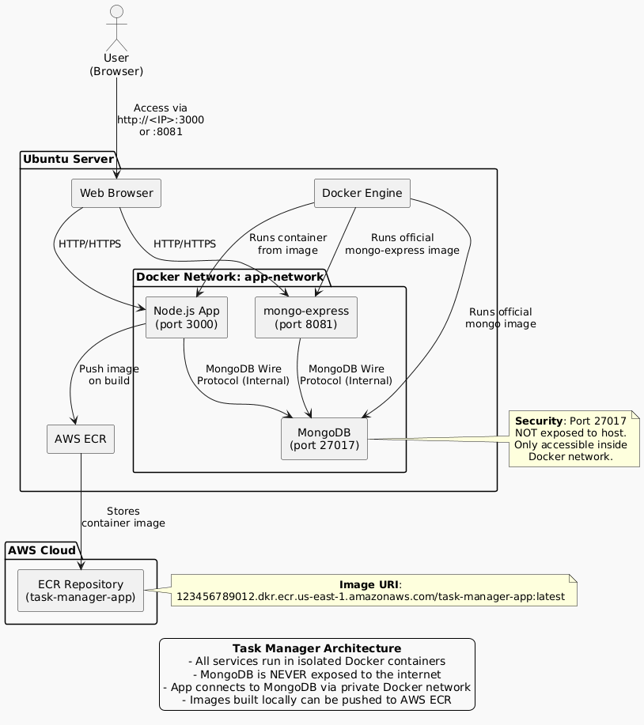
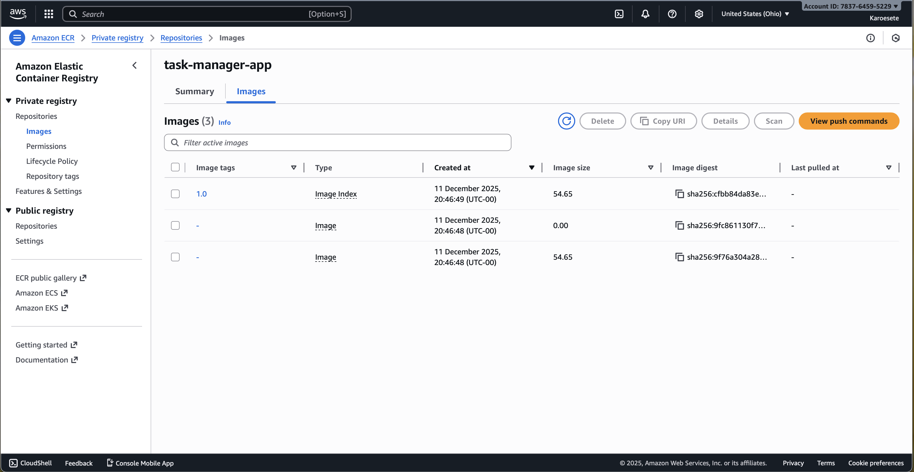

# 📝 Task Manager: Full-Stack App on Ubuntu with Docker & AWS ECR

**MongoDB + Node.js + mongo-express — From Ubuntu VM to AWS Cloud**

A complete, production-ready task management application designed for **Ubuntu Server**, containerized with **Docker**, and deployable to the cloud via **AWS ECR (Elastic Container Registry)**.

## 🎯 Features

✅ Full CRUD task management with responsive UI

✅ Runs on Ubuntu Server (20.04/22.04 LTS) using Docker Engine (no Docker Desktop needed)

✅ Secure container image built with best practices (non-root user, minimal size)

✅ One-command build & push to AWS ECR

✅ Private Docker network — MongoDB never exposed to the internet

✅ Zero manual database setup — auto-creates on first task

## Architectural Diagram



## 🖥️ Prerequisites (Ubuntu Server)

- Ubuntu 20.04 or 22.04 LTS (local VM, cloud instance, or bare metal)
- User with sudo privileges
- Docker Engine and Docker Compose installed
- Git (optional, for version control)

## 🚀 Part 1: Set Up on Ubuntu Server

Step 1: Install Docker & Docker Compose
```
# Update system
sudo apt update && sudo apt upgrade -y

# Install Docker
sudo apt install -y apt-transport-https ca-certificates curl gnupg lsb-release

sudo mkdir -p /etc/apt/keyrings

curl -fsSL https://download.docker.com/linux/ubuntu/gpg | sudo gpg --dearmor -o /etc/apt/keyrings/docker.gpg

echo "deb [arch=$(dpkg --print-architecture) signed-by=/etc/apt/keyrings/docker.gpg] https://download.docker.com/linux/ubuntu $(lsb_release -cs) stable" | sudo tee /etc/apt/sources.list.d/docker.list > /dev/null

sudo apt update

sudo apt install -y docker-ce docker-ce-cli containerd.io docker-compose-plugin

# Add user to docker group
sudo usermod -aG docker $USER
newgrp docker  # Or log out and back in
```

Verify:

```
docker --version      # Docker version 24.0+
docker compose version # Docker Compose version v2.24+
```

## Step 2: Create the Project

```
mkdir ~/task-manager && cd ~/task-manager
```

Create the following files:

📄 app/Dockerfile **(The Heart of Your App)**

This file builds a secure, production-ready container image for your Node.js app.

```
# Use official Node.js 18 (Alpine = small size)
FROM node:18-alpine

# Set working directory inside container
WORKDIR /usr/src/app

# Create non-root user for security
RUN addgroup -g 1001 -S nodejs && \
    adduser -S nextuser -u 1001

# Copy package files FIRST (for Docker layer caching)
COPY package*.json ./

# Install ONLY production dependencies
RUN npm ci --omit=dev && npm cache clean --force

# Copy app source code
COPY . .

# Set ownership to non-root user
RUN chown -R nextuser:nodejs .
USER nextuser

# Document the port the app uses
EXPOSE 3000

# Start the application
CMD ["node", "server.js"]
```

## 📄 app/package.json

```
{
  "name": "task-manager",
  "version": "1.0.0",
  "main": "server.js",
  "scripts": {
    "start": "node server.js"
  },
  "dependencies": {
    "cors": "^2.8.5",
    "express": "^4.19.2",
    "mongoose": "^8.4.0"
  }
}
```

## 📄 app/server.js
```
const express = require('express');
const mongoose = require('mongoose');
const cors = require('cors');

const app = express();
const PORT = 3000;

app.use(cors());
app.use(express.json());
app.use(express.static('public'));

// Connect to MongoDB (inside Docker network)
const mongoUri = process.env.MONGODB_URI || 'mongodb://localhost:27017/taskmanager';
mongoose.connect(mongoUri)
  .then(() => console.log('✅ Connected to MongoDB'))
  .catch(err => console.error('❌ MongoDB connection error:', err));

const taskSchema = new mongoose.Schema({
  text: { type: String, required: true, trim: true },
  completed: { type: Boolean, default: false },
  createdAt: { type: Date, default: Date.now }
});

const Task = mongoose.model('Task', taskSchema);

// === API Routes ===
app.get('/api/tasks', async (req, res) => {
  const tasks = await Task.find().sort({ createdAt: -1 });
  res.json(tasks);
});

app.post('/api/tasks', async (req, res) => {
  const task = new Task({ text: req.body.text });
  const newTask = await task.save();
  res.status(201).json(newTask);
});

app.put('/api/tasks/:id', async (req, res) => {
  const task = await Task.findByIdAndUpdate(req.params.id, { text: req.body.text }, { new: true });
  if (!task) return res.status(404).json({ message: 'Task not found' });
  res.json(task);
});

app.patch('/api/tasks/:id/toggle', async (req, res) => {
  const task = await Task.findById(req.params.id);
  if (!task) return res.status(404).json({ message: 'Task not found' });
  task.completed = !task.completed;
  res.json(await task.save());
});

app.delete('/api/tasks/:id', async (req, res) => {
  const task = await Task.findById(req.params.id);
  if (!task) return res.status(404).json({ message: 'Task not found' });
  await task.deleteOne();
  res.json({ message: 'Task deleted' });
});

app.listen(PORT, '0.0.0.0', () => {
  console.log(`🚀 Server running on port ${PORT}`);
});
```

📄 docker-compose.yml **(Orchestrates Everything)**

```
version: '3.8'

services:
  mongodb:
    image: mongo:6.0
    container_name: task-mongo
    restart: unless-stopped
    environment:
      MONGO_INITDB_DATABASE: taskmanager
    volumes:
      - mongo_/data/db
    networks:
      - app-network

  mongo-express:
    image: mongo-express:1.0
    container_name: task-mongo-express
    restart: unless-stopped
    ports:
      - "8081:8081"
    environment:
      ME_CONFIG_MONGODB_SERVER: mongodb
      ME_CONFIG_MONGODB_PORT: 27017
      ME_CONFIG_MONGODB_ENABLE_ADMIN: "true"
      ME_CONFIG_BASICAUTH_USERNAME: admin
      ME_CONFIG_BASICAUTH_PASSWORD: password
    depends_on:
      - mongodb
    networks:
      - app-network

  app:
    build: ./app
    container_name: task-app
    restart: unless-stopped
    ports:
      - "3000:3000"
    environment:
      MONGODB_URI: mongodb://mongodb:27017/taskmanager
    depends_on:
      - mongodb
    networks:
      - app-network

volumes:
  mongo_

networks:
  app-network:
    driver: bridge
    
```

## Step 3: Launch on Ubuntu
```
# Start all services
docker compose up -d --build

# Check status
docker compose ps
```

Access:
- **App**: `http://<YOUR_UBUNTU_IP>:3000`
- **mongo-express:** `http://<YOUR_UBUNTU_IP>:8081` (login: admin / password)

### ☁️ Part 2: Push App Image to AWS ECR

Now let’s build your app image and push it to AWS Elastic Container Registry (ECR) so you can deploy it anywhere in AWS.

### Step 1: Create an ECR Repository

- Create a new repository on AWS
- Click on the repository then click on `view push commands`
- Make sure that you have the latest version of the AWS CLI and Docker installed
- Retrieve an authentication token and authenticate your Docker client to your registry. Use the AWS CLI:
```
aws ecr get-login-password --region us-east-2 | docker login --username AWS --password-stdin 783764595229.dkr.ecr.us-east-2.amazonaws.com
```
- After the build is completed, tag your image so you can push the image to this repository:
```
docker tag task-manager-app:latest 783764595229.dkr.ecr.us-east-2.amazonaws.com/task-manager-app:latest
```
- Run the following command to push this image to your newly created AWS repository:
```
docker push 783764595229.dkr.ecr.us-east-2.amazonaws.com/task-manager-app:latest
```

If done correctly, it should puch into AWS ECR and you should see the similar contents below:



